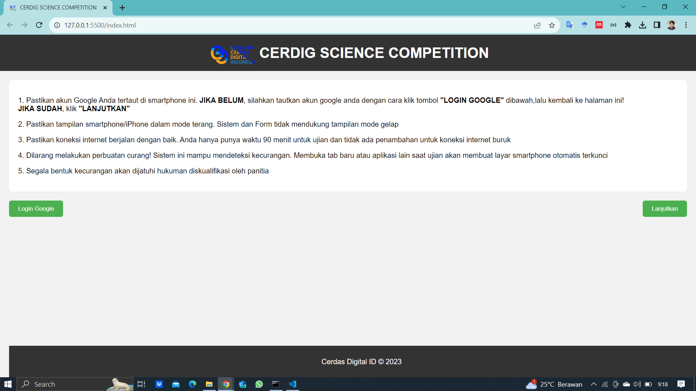
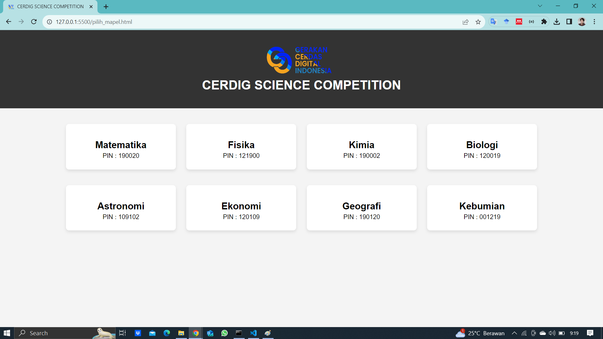

# Simple Web-Based Spplication for Science Olympiads
Aplikasi berbasis web ini dirancang sebagai platform sederhana untuk mengelola olimpiade sains. Sebagai langkah tambahan dalam meningkatkan keamanan Google Form, saya telah menambahkan fitur berupa halaman utama dengan tombol yang terkunci, dan tombol tersebut hanya akan terbuka setelah mencapai waktu yang ditentukan. Selain itu, aplikasi ini dilengkapi dengan deteksi perubahan tab atau aplikasi (visibilitas tab) untuk mencegah tindakan tidak sah.

Untuk menguatkan keamanan, saya juga menambahkan fitur kunci pop-up yang akan aktif jika terdeteksi adanya upaya kecurangan. Pop-up tersebut akan mencegah siswa untuk merefresh halaman, karena nilai waktu timer disimpan dalam local storage sehingga tidak dapat diubah secara sembarangan. Dengan demikian, aplikasi ini memberikan lapisan perlindungan tambahan dan meningkatkan integritas dari olimpiade sains ini.

| Main-page Rules                        |
|------------------------------------|
|  |

| Pilih Mapel Olimpiade                       | PopUp Kecurangan                     |
|-------------------------------|-------------------------------|
|  |  |
